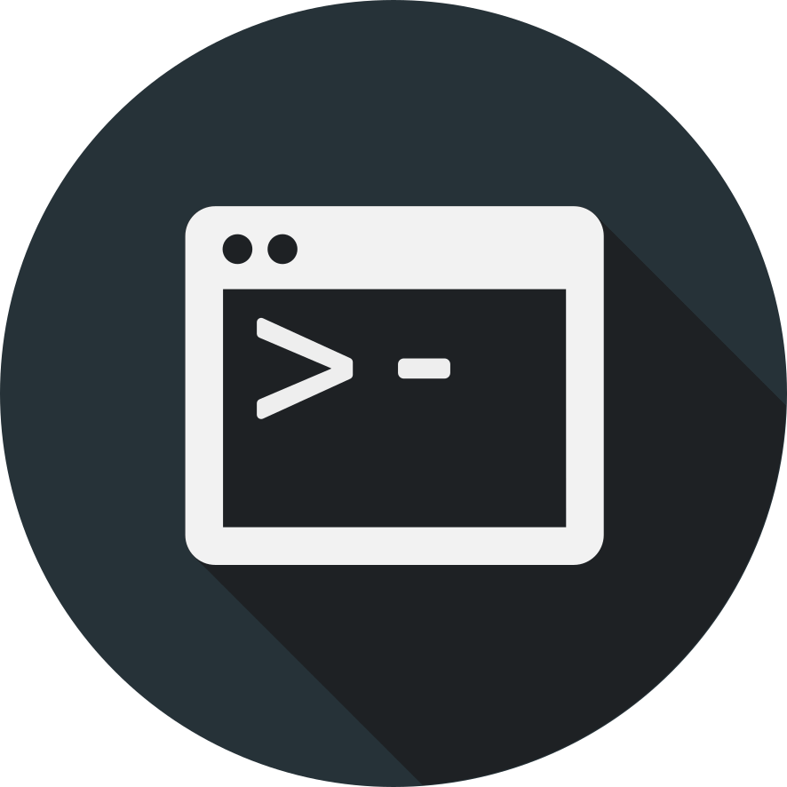

# Mirage
A online judge system built on nodejs and vuejs.
## Background
In the past few years, I have deployed many Online Judge system like "Hust OJ" and "Domjudge" for ICPC team of my school - QLUT. But neither satisfied me since there are always some difficulties when teacher told me to modify them and it happens quite often. Unless I have full control over the system only then I can be happy when teachers and team members of ICPC team told me to add some function to the platform. I have tried to develop it for several times and I kept fail due to my laziness and the lack of knowledge(actually 100% due to laziness). But the time has come, my graduation project must be finished it's the new deadline that I set for myself. So I decided to fully devote myself into the making of this project. In this project called "Mirage"(referring to a map of a game that I played a lot but failed to be a good player), I will try my best to fullfill my dream which is building an Online Judge system from nothing(actually not since many frameworks are used) that can actually runs. I hope this project can goes well and please Vue3 and Vite, don't be too good, Vue2 and Webpack 5 is all I have right now.

## Install
An install script will be shown here as soon as someone makes it.

## Usage
An usage guide will be shown here as soon as someone makes it.

## Support
Support all modern browsers eg. Chrome, Firefox, Edge, Safari.

## Development

### Core
Core is the judger module that takes a submission in, compiles it, runs it and judges it by predefined input and output data. Core is an node addon built on the [node-addon-api](https://github.com/nodejs/node-addon-api). It's written in C++ and compiled to a node addon file which has an extension of ".node" and can be required directly by the JavaScript code running on Node.js. Futher development of this core needs knowledge related to the following topics:
* JavaScript
* Node.js
* C/C++ Language
* node-addon-api
* Linux programming(There's a book called APUE, read it)

### Frontend
Frontend is the SPA frontend module that based on Vue and Vuetify. Vue as the data management and modulize framework and Vuetify is an UI framework based on the material design which is actually my favorite design language. The following technologies are been used by frontend module.
* ECMAScript 6(Promise, spread syntax...)
* Vue 2
* Vue Router
* Vuex
* Vue i18n
* Vuetify 2
* axios
* markdown it
* highlight.js
* katex
* Ace Editor

#### Frontend File Structure
```
frontend
│
└───api       A wrapper of Axios for error message and api mocking
│   
└───assets    Static files
│   
└───components  Components of views
│   
└───locale    Internationalization(i18n) related
│   
└───plugins   Vuetify, highlight.js, notify, markdown-it, Ace plugins
│   
└───router    Vue Router routes
│   
└───store     Vuex stores
│   
└───style     Global style. color theme defined in plugins/theme.js
│   
└───utils     Some util for form verify and other things
│   
└───views     Vue components for the main part of App.vue
│   
└───App.vue   Application Component
│   
└───index.html  Template html
│   
└───index.js  Entry file
```

### Backend
Backend is a normal Node.js program based on Koa.js and MongoDB. It's in charge of most system logic and all data persistence operations. It provides an RESTful API to clients like a normal backend do. Judger addon is called by this module when needed. It uses the following technologies to achieve that.
* Koa
* MongoDB
* Winston

## Contributors
[@CamWang](https://github.com/camwang)
[@cbl012943](https://github.com/cbl012943)

## Acknowledgements
Special thanks go to my tutor WengPeng at UP366 which is my intern company who helps a lot improving my code skills.
The Core module won't exist without Hust OJ project and friends from school ICPC team.
Thanks my neck which went through a lot of pain during my intense programming hours.

## License
[MIT](LICENSE)
Copyright © 2021, Wang Can