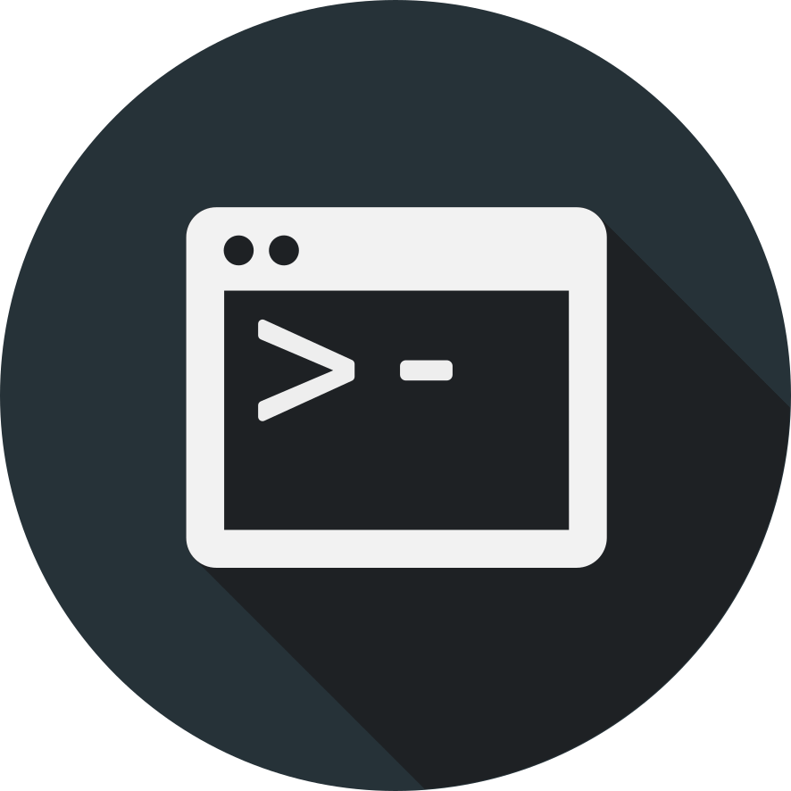

# Mirage
一个基于Node.js与Vue.js的在线判题系统
[](https://github.com/CamWang/mirage/actions/workflows/ci.yml)
## 项目背景
在过去的几年里，我给齐工大的ICPC队伍部署过一些在线判题系统，比如HustOJ和Domjudge。但是当老师要求一些新功能时我总是会遇到很多扩展的困难，俩系统都不能完全满足需求。感觉除了对系统有百分百的控制，我才能乐意去做老师和队员对系统提出的功能扩展。我曾经和一些同学做过几次尝试，但由于我有点懒然后又naive（也是因为懒），所以几次尝试都失败了。毕设ddl临近，我又有信心这次能把这个系统做完，这次我会尽力完成我一直想从零开始（伪，还是用到了很多框架）做一个真正能放在线上跑的在线判题系统。我希望这个项目能进展顺利。Vue3和Vite，我现在能用的就只能是Vue2和Webpack了，所以你们不要搞得太完美。

## 安装脚本
当做出来了之后，这里会有一个安装脚本

## 使用指南
当做出来了之后，这里会有一个使用指南

## 支持情况
支持所有现代浏览器，比如Chrome，Firefox或Safari。后端的开发与测试环境为Ubuntu Server 20.04 LTS

## 开发

### 开发项目
项目分为三个模块，core核心模块是C++编写的判题机，frontend是基于Vue2的前端，backend是基于Nodejs的后端。推荐使用“适用于Linux的Windows子系统”简称WSL的WSL2版本安装Ubuntu环境，配合Visual Studio Code以及其Remote WSL插件进行本地的跨平台开发。在配置好环境后使用git工具clone仓库，并在三个内执模块行`npm install`指令就可以配置好项目。三个模块的运行测试指令有所不同，可以参照对应目录下的package.json来查看运行与测试指令。

### Core 核心模块
Core 核心模块是一个判题机，它具有接受程序题代码题解、编译、运行和使用预先指定的输入输出与用户代码执行输出进行比对来进行判题，并记录用户程序运行占用系统资源情况的功能。在技术上，Core 核心模块使用基于[node-addon-api](https://github.com/nodejs/node-addon-api)的Node Addon插件技术。核心模块是使用C++编写的，并使用node-gyp工具编译为“.node”格式的node插件，该插件可以直接被运行在Node.js上的Javascript代码引入并调用。进一步对平台进行开发需要到下列技术相关知识：
* JavaScript
* Node.js
* C/C++ Language
* node-addon-api
* Linux programming(有一本叫APUE的书可以参考)

### Frontend 前端
Frontend是一个基于Vue和Vuetify框架的前端单页应用模块。Vue作为数据管理与模块化框架，Vuetify是一个基于我最喜欢的材料设计的UI框架。前端模块中使用了以下技术：
* ECMAScript 6(Promise, spread syntax...)
* Vue 2
* Vue Router
* Vuex
* Vue i18n
* Vuetify 2
* axios
* markdown it
* highlight.js
* katex
* Ace Editor

#### 前端文件结构
```
frontend
│
└───api       一个对axios的封装来做mock等功能
│   
└───assets    静态文件
│   
└───components  进一步封装的ui组件
│   
└───locale    国际化i18n相关
│   
└───plugins   Vuetify, highlight.js, notify, markdown-it, Ace plugins
│   
└───router    Vue Router 路由
│   
└───store     Vuex 储存
│   
└───style     全局样式. 颜色主题在plugins/theme.js里定义
│   
└───utils     一些用于验证或者其他用途的工具函数
│   
└───views     主要的视图组件，是构成App.vue的模块，也是对components里ui组件的封装
│   
└───App.vue   主要的应用组件
│   
└───index.html  模板html
│   
└───index.js  入口文件
```

### Backend 后端
后端是一个普通的基于Koa.js与MongoDB的Node.js程序。后端是负责主要系统逻辑和数据持久化的部分。它就像其他项目的后端那样对外提供一个RESTful API允许客户端（通常为前端）进行请求获取数据。它对内，在需要的时候会调用判题机插件进行判题。后端使用到了以下技术
* Koa
* MongoDB
* Mongoose（MongoDB的对象关系映射框架）
* Winston

## 贡献者
[@CamWang](https://github.com/camwang)
[@along](https://github.com/starnightw)
[@cbl012943](https://github.com/cbl012943)
[@shiqi00](https://github.com/Shiqi00)
[@zhangzhibang0309](https://github.com/zhangzhibang0309)

## 后记
感谢列在上方的代码贡献者
特别感谢在天学网工作时我的导师翁鹏，在技术进步方面帮了我很多
判题机的编写HUST OJ项目与学校ICPC队伍的支持
谢谢我在码代码时承受了很多压力的脖子

## License
[MIT](LICENSE)
Copyright © 2021, Wang Can
